# Error Cases

Error cases are scenarios where a service or component goes down or fails unexpectedly. Client-side behavior (expired quotes, bad prices, partial fills, denied reservations) is documented in the workflow cases.

---

## Submitting External Orders

### Error Case 1: Exchange goes down before handling the order
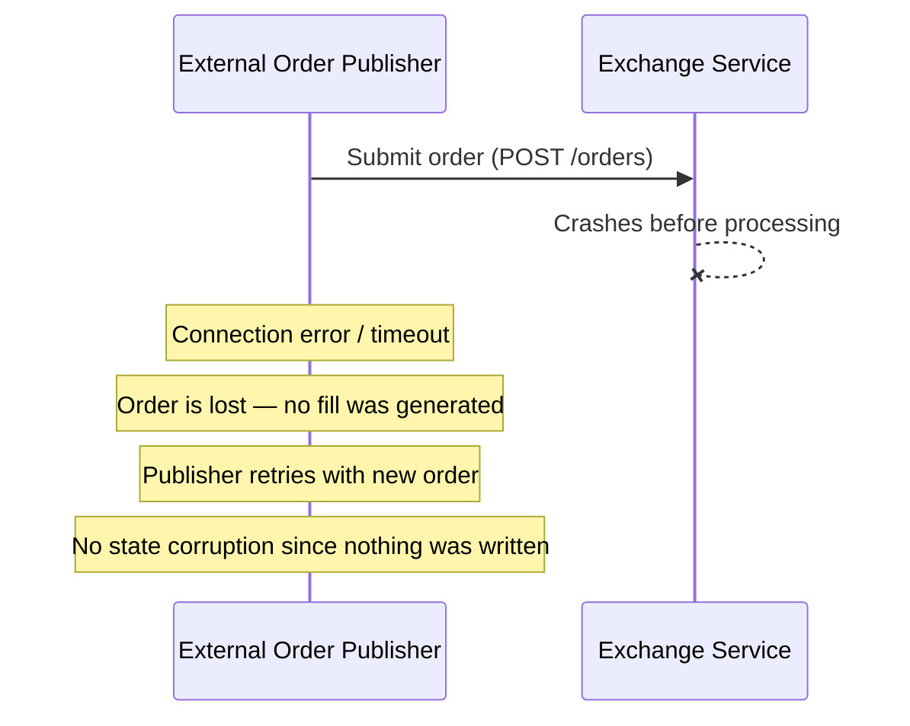
**Outcome:** The order is simply lost. No fill was created, no position changed, and no exposure was affected. The external order publisher can retry by submitting a new order. Since the order never reached the matching engine, there is no risk of duplicate fills or inconsistent state.

---

### Error Case 2: Exchange goes down after sending the fill but before confirming to the publisher
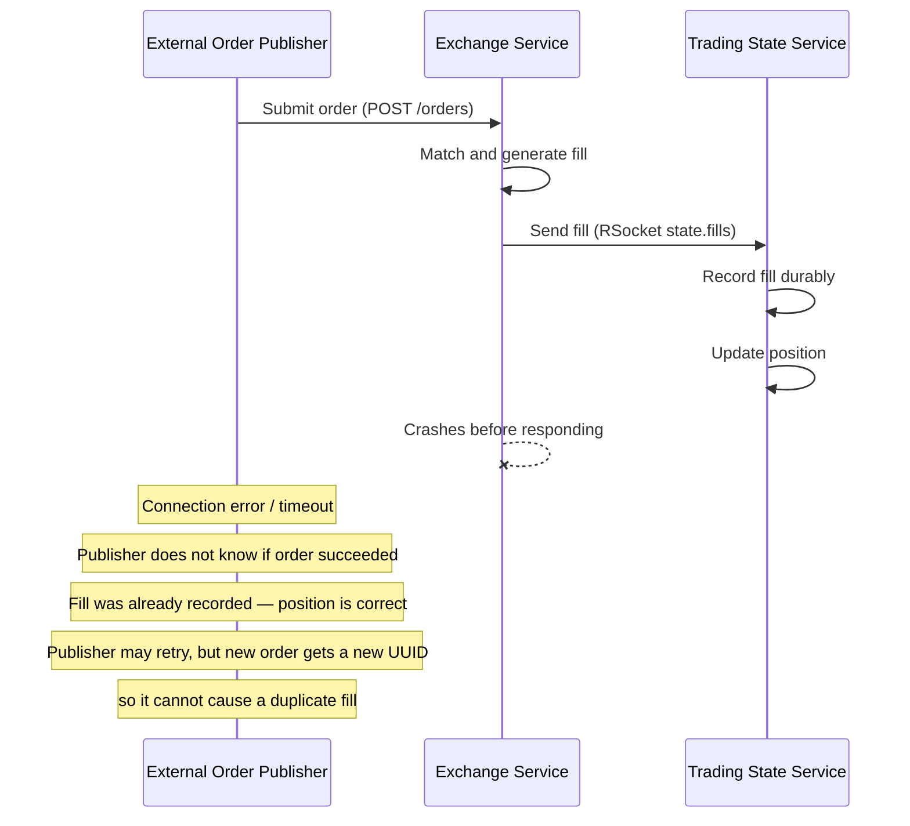
**Outcome:** The fill was already sent to and recorded by the trading state service, so the position is correct. The publisher sees a timeout and doesn't know if the order succeeded. If it retries, the new order has a new UUID and is treated as a separate order — no duplication. The quote's remaining quantity was already decremented before the crash.

---

### Error Case 3: Trading state service goes down before handling the fill
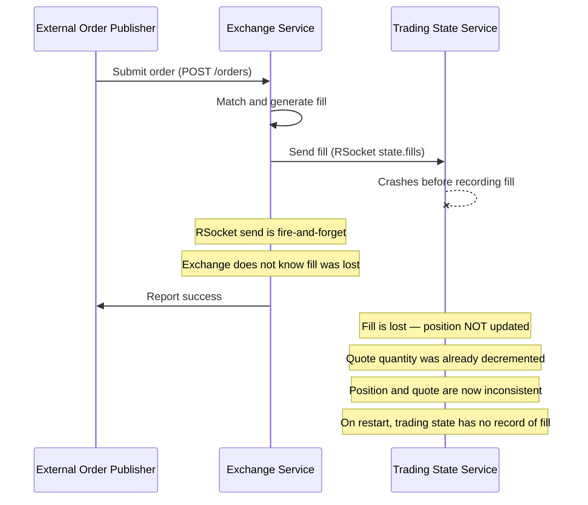
**Outcome:** This is a critical inconsistency. The exchange already decremented the quote's remaining quantity, but the fill was never recorded. The position does not reflect the trade. Since RSocket fire-and-forget provides no delivery guarantee, the fill is lost. The quote will eventually expire (30s TTL), releasing its exposure, and the market maker will publish a new quote based on the (stale) position. This represents a known gap — a more robust design would use at-least-once delivery with idempotent fill recording.

---

## Updating Quote

### Error Case 4: Market maker goes down before handling the position update
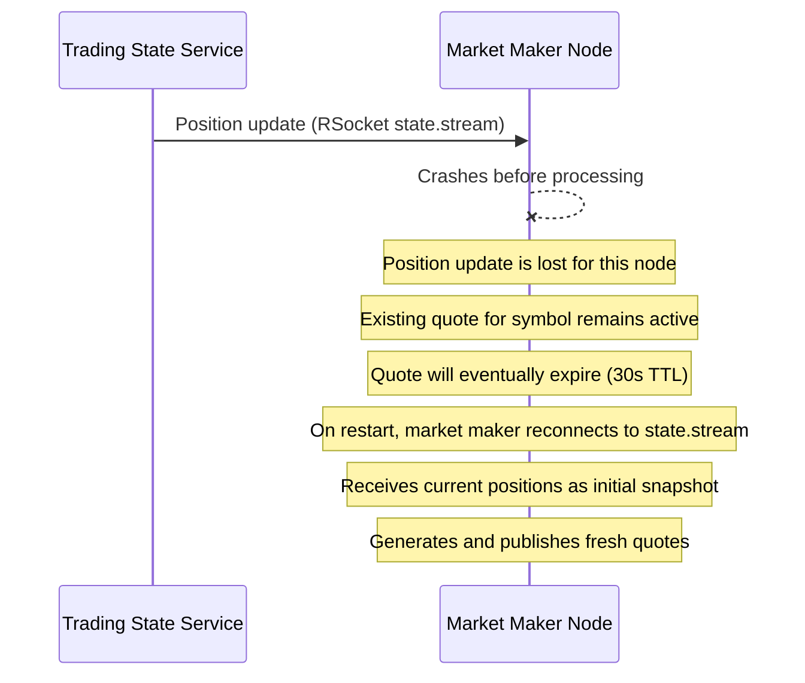
**Outcome:** The position update is lost for this market maker instance. The currently active quote (if any) continues until its TTL expires. When the market maker restarts, it reconnects to `state.stream`, receives the full current position snapshot, and resumes publishing quotes based on the latest committed state.

---

### Error Case 5: Market maker goes down after sending reservation but before sending new quote
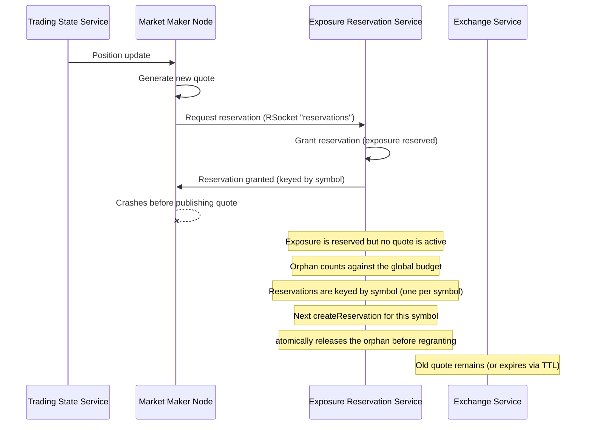
**Outcome:** Exposure is reserved but no quote is live, so capacity is briefly leaked — and because usage is summed globally across all symbols, the orphan reduces the budget available to other symbols until it is reclaimed. The leak is **bounded and self-healing**, not permanent. Reservations are keyed by symbol (a reservation's `id` *is* its symbol), so there is at most one per symbol, and `ExposureReservationService.createReservation` releases any existing reservation for that symbol before granting a new one; the whole method is `synchronized`, so the release-and-regrant is atomic. The next quote cycle for the symbol therefore reclaims the orphan automatically: on restart the market maker reconnects to `state.stream`, receives the position snapshot, and regenerates quotes (the Error Case 4 path); even without a restart, `QuoteFreshnessKeeper` periodically refreshes every MM-owned symbol — including symbols whose quote is missing or expired — issuing a fresh reservation that supersedes the orphan. There is no reservation TTL: recovery is purely supersede-driven, so the leak window is bounded by the next quote refresh rather than by an expiry timer.

---

### Error Case 6: Reservation service goes down before updating reservation
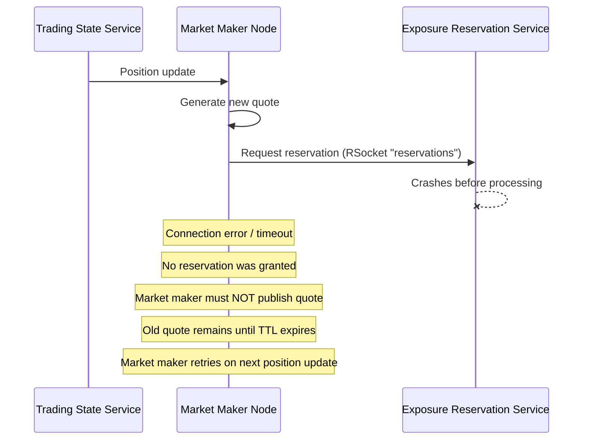
**Outcome:** The market maker receives an error when trying to reserve exposure. Per the authority boundaries, a quote must not become active without a granted reservation. The market maker does not publish the quote. The old quote (if any) remains until it expires. On the next position update or refresh cycle, the market maker retries.

---

### Error Case 7: Exchange service goes down before updating quote
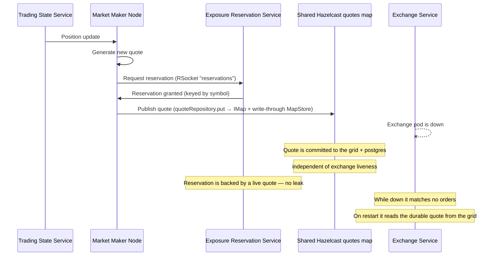
**Outcome:** In production the market maker does **not** publish quotes by calling the exchange over HTTP. It writes the reserved quote to the shared Hazelcast `quotes` map (`ProductionQuoteGenerator` → `quoteRepository.put`), which is replicated across the cluster and write-through-persisted to PostgreSQL. The exchange reads quotes from that same grid. So an exchange pod going down does not lose the quote or orphan the reservation — both the quote and its reservation are committed. While the exchange leader is down no new orders are matched (clients fail over to the ZooKeeper-re-elected leader), and when the exchange returns it serves the already-durable quote. The `PUT /quotes/{symbol}` endpoint on the exchange (`ExchangeService.putQuote`) exists only for initial bootstrap — it no-ops when a quote already exists — not for steady-state publication.

---

## Streaming Position Data Updates

### Error Case 8: Connected trading state service goes down
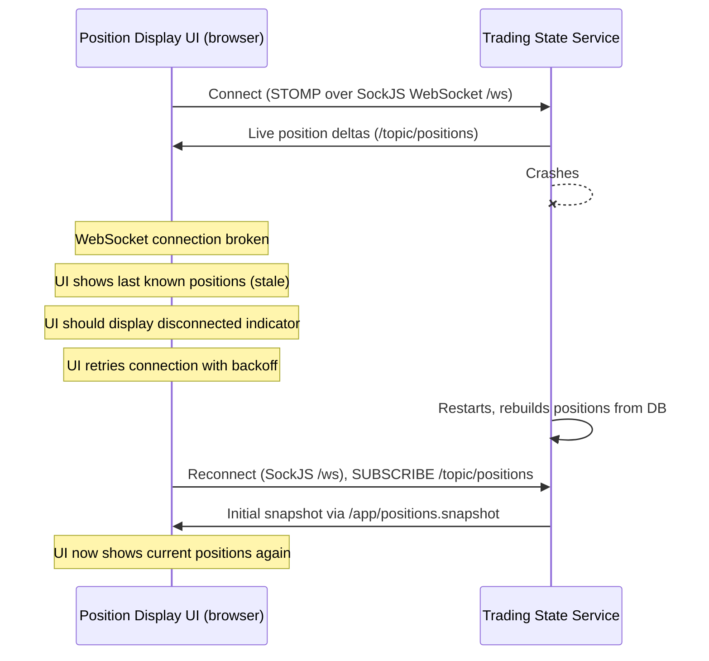
**Outcome:** The browser UI talks to trading-state over **STOMP on a SockJS WebSocket** (`/ws`), not RSocket. When the connection breaks it shows stale data, should surface a disconnected indicator, and retries with backoff. When the trading state service restarts, it rebuilds positions from PostgreSQL via the Hazelcast MapStore; the UI reconnects, fetches an initial snapshot via `/app/positions.snapshot`, and resumes live deltas on `/topic/positions`. (Market-maker pods consume the same multicast `StateSnapshot` stream over a separate RSocket `state.stream` request-stream — that transport is covered by Error Cases 4–5.)

---

## Exposure Lifecycle Errors

### Error Case 9: Fill arrives but reservation apply-fill fails
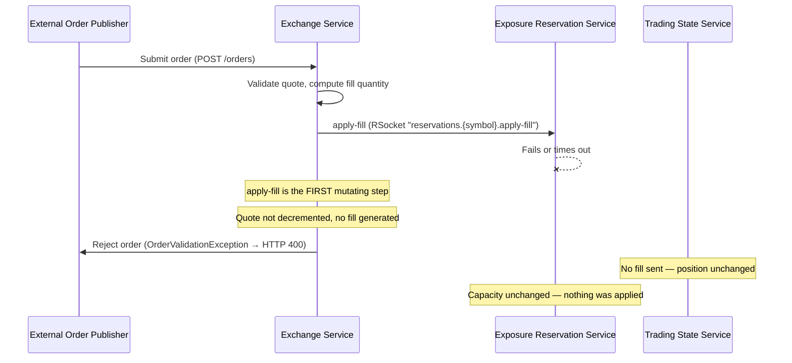
**Outcome:** In production the **exchange**, not the market maker, applies fills to reservations. `FillOrderDispatcher.dispatchOrder` calls `reservations.{symbol}.apply-fill` (RSocket request-response, keyed by symbol) as the **first** mutating step — before it decrements the quote or sends the fill to trading-state. If that call fails or returns no response, it throws `OrderValidationException` (mapped to HTTP 400 for the publisher): the quote is left untouched, no fill is generated, and trading-state never sees a fill. So there is no over-reservation and no position/quote drift — the order simply fails and the publisher may retry. (The market maker plays no part in apply-fill.)

---

### Error Case 10: Market maker crashes during quote replacement cycle
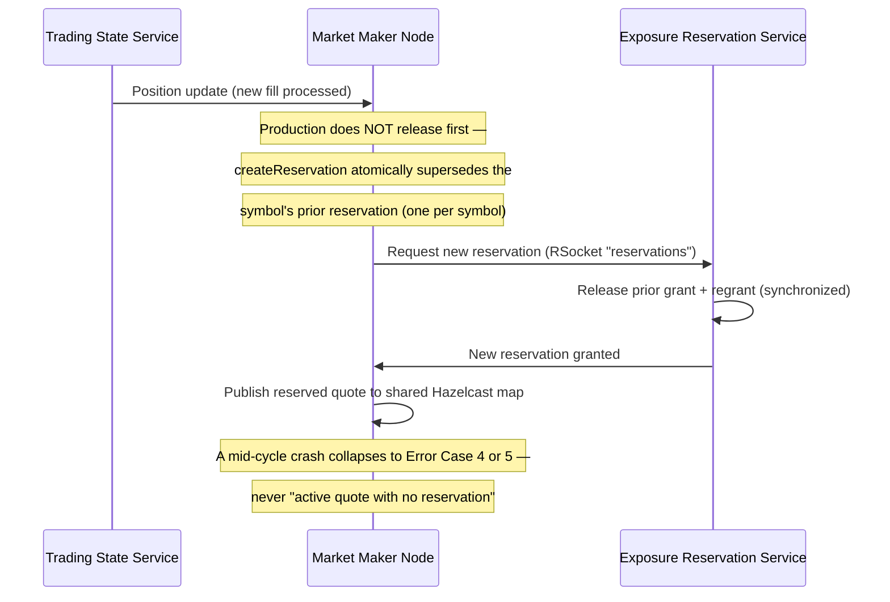
**Outcome:** The "release the old reservation, then request a new one" sequence does not exist in production. `ProductionQuoteGenerator` requests the new reservation over the RSocket `reservations` route, and `ExposureReservationService.createReservation` releases the symbol's prior reservation and regrants in a single `synchronized` call (there is exactly one reservation per symbol, keyed by symbol). A crash during the replacement cycle therefore collapses into an already-covered case: before the reservation call → **Error Case 4** (old quote and reservation intact); after the grant but before the quote is published → **Error Case 5** (self-healing orphan). The "active quote with no backing reservation" window is only reachable through the fault-injection harness (`ProductionQuoteGenerator.maybeTriggerError10Crash`), which deliberately calls `reservations.{symbol}.release` and then `Runtime.halt` to reproduce the scenario for `ClusterError10…Test`; even then it is bounded by the quote's 30s TTL.

---

## Full System Restart

### Error Case 11: Recovery after full system restart
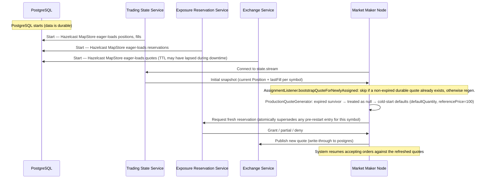
**Outcome:** Each service rebuilds from durable storage via `MapStoreConfig.InitialLoadMode.EAGER`. There is no separate startup pass to "scan and expire" stale entries — quote expiry is handled lazily on read (the exchange's `FillOrderDispatcher` rejects orders against expired quotes, and `ProductionQuoteGenerator` treats an expired survivor as if no quote existed when it regenerates). Reservation exposure totals are derived on every `createReservation` call by summing `Reservation.grantedBid/grantedAsk` across the loaded `reservations` IMap, so the global capacity is correct as soon as the MapStore finishes its eager load. Market makers reconnect to `state.stream`, receive the position snapshot (with `lastFill`, enabling inventory-aware skew on the first regen), and resume quoting. End-to-end coverage lives in `ClusterError11RecoveryAfterFullSystemRestartTest` / `LocalError11RecoveryAfterFullSystemRestartTest`; the cluster variant intentionally does **not** restart `sts/zk` or `sts/postgres` because those are the durable layer being relied on.
